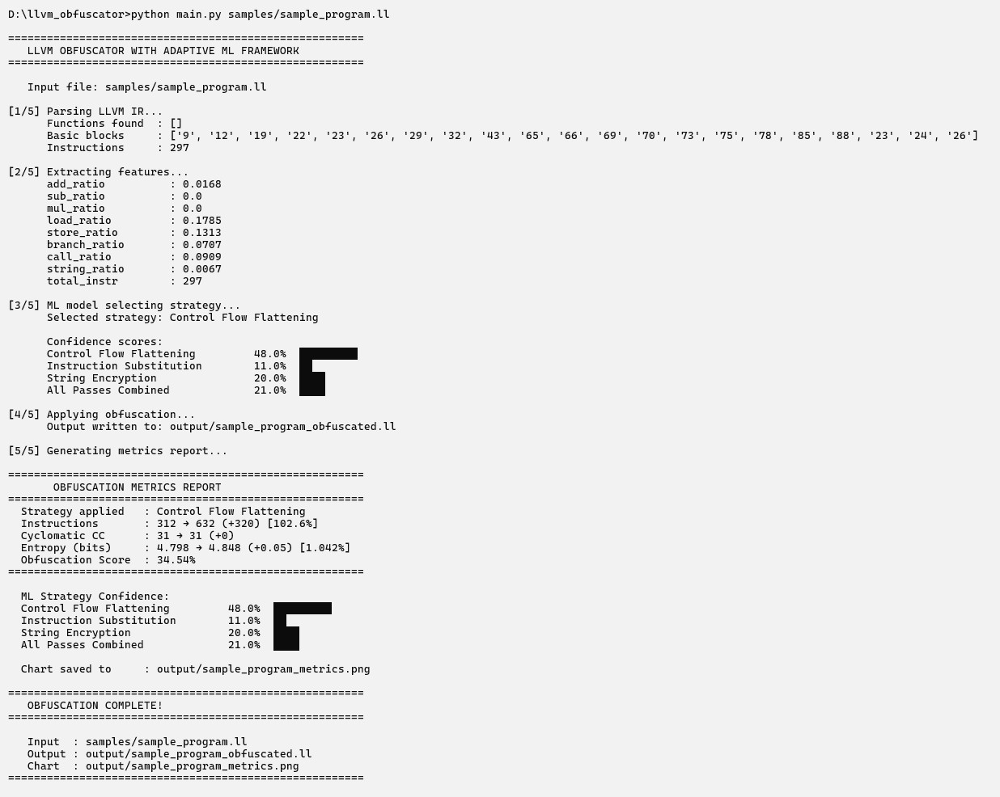
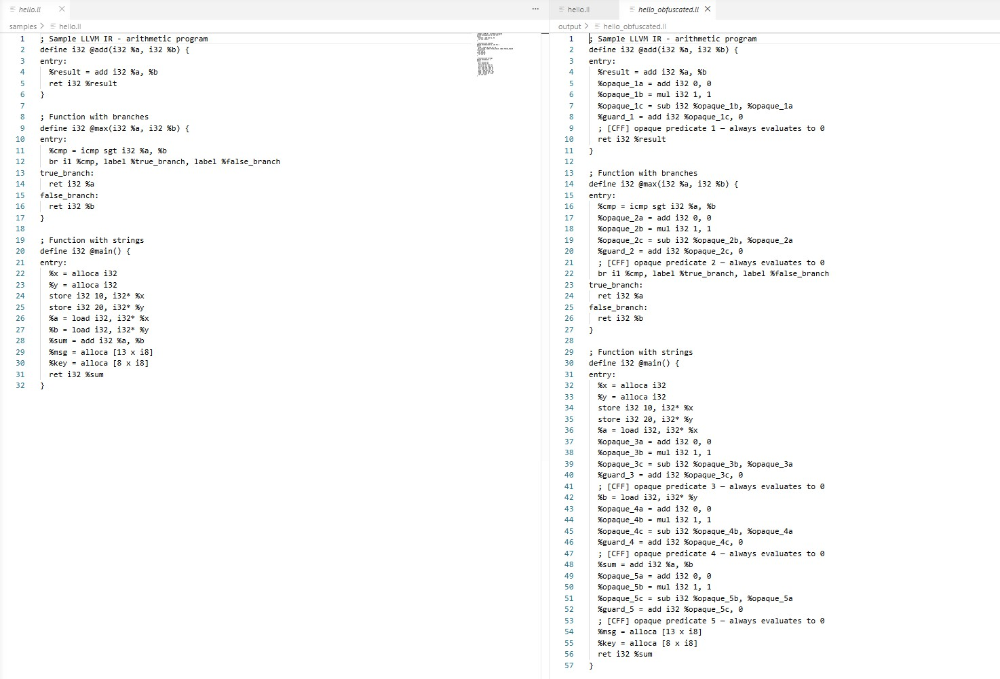
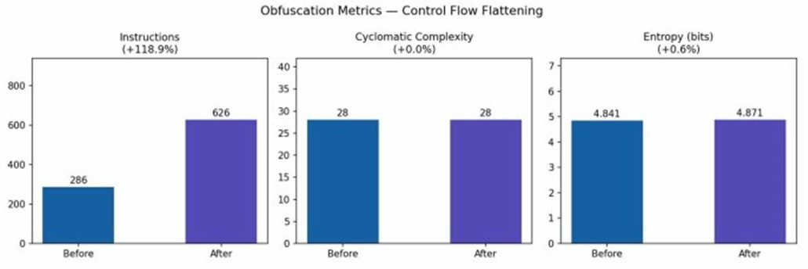

# 🛡️ Adaptive LLVM Code Obfuscation using Machine Learning

An intelligent LLVM-based software obfuscation framework that leverages **Machine Learning** to automatically select the most suitable obfuscation strategy based on program characteristics.

The framework operates on **LLVM Intermediate Representation (IR)** and combines compiler technology with **Machine Learning** to provide adaptive, secure, and efficient software protection against reverse engineering.

---

# 📑 Table of Contents

- [📌 Project Description](#-project-description)
- [✨ Project Highlights](#-project-highlights)
- [🏗️ Architecture / Workflow](#️-architecture--workflow)
- [🚀 Features](#-features)
- [📂 Repository Structure](#-repository-structure)
- [⚡ Quick Start](#-quick-start)
- [🔍 Before / After Example](#-before--after-example)
- [📊 Results](#-results)
- [🖼️ Screenshots](#️-screenshots)
- [📚 Documentation](#-documentation)
- [🔬 Research Paper](#-research-paper)
- [📘 Project Report](#-project-report)
- [🔮 Future Work](#-future-work)
- [👩‍💻 Author](#-author)
- [📄 License](#-license)

---

# 📌 Project Description

Adaptive LLVM Code Obfuscation using Machine Learning is an intelligent software protection framework developed to enhance the security of compiled applications against reverse engineering attacks.

The framework analyzes **LLVM Intermediate Representation (IR)**, extracts structural program features, predicts the most suitable obfuscation strategy using a **Random Forest classifier**, and applies compiler-level obfuscation techniques while preserving program functionality.

The project integrates compiler design, software security, and machine learning to provide an adaptive and research-oriented approach to code protection.

---

# ✨ Project Highlights

- 🛡 LLVM IR–based software protection
- 🤖 Machine Learning–driven obfuscation strategy selection
- 🌲 Random Forest classifier
- 🔀 Control Flow Flattening
- 🔄 Instruction Substitution
- 🔐 XOR-based String Encryption
- 📊 Obfuscation metrics generation
- 📈 Complexity and entropy analysis
- 🧩 Modular project architecture
- 🎓 Research-oriented implementation, published in IJRASET (Vol. 14, Issue IV, April 2026)

---

# 🏗️ Architecture / Workflow

```text
                LLVM IR File (.ll)
                       │
                       ▼
                IR Parser Module
                       │
                       ▼
             Feature Extraction
                       │
                       ▼
          Random Forest Classifier
                       │
                       ▼
        Strategy Prediction Engine
                       │
        ┌──────────────┼──────────────┐
        ▼              ▼              ▼
 Control Flow   Instruction      String
 Flattening     Substitution     Encryption
        └──────────────┼──────────────┘
                       ▼
            Obfuscated LLVM IR
                       │
                       ▼
      Metrics & Visualization Report
```

### Workflow Overview

1. Parse LLVM IR.
2. Extract program features.
3. Predict the best obfuscation strategy.
4. Apply compiler-level obfuscation.
5. Generate evaluation metrics and reports.

---

# 🚀 Features

- LLVM IR Parsing
- Static Code Analysis
- Feature Extraction
- Machine Learning-Based Strategy Prediction
- Control Flow Flattening
- Instruction Substitution
- XOR-based String Encryption
- Obfuscation Metrics
- Visualization Reports
- Modular Architecture
- Command-Line Execution

---

# 📂 Repository Structure

```text
llvm-code-obfuscator/
│
├── docs/              # Documentation, certificate, screenshots
├── ml/                # Machine Learning modules
├── obfuscation/       # Obfuscation techniques
├── paper/             # Research paper
├── parser/            # LLVM IR parser
├── report/            # Metrics and reporting
├── samples/           # Sample C and LLVM IR files
│
├── main.py
├── requirements.txt
├── README.md
├── LICENSE
└── .gitignore
```

---

# ⚡ Quick Start

**1. Clone the repository**
```bash
git clone https://github.com/whysnavi/llvm-code-obfuscator.git
```

**2. Navigate to the project**
```bash
cd llvm-code-obfuscator
```

**3. Install dependencies**
```bash
pip install -r requirements.txt
```

**4. Run the framework on a sample**
```bash
python main.py samples/hello.ll
```

**5. View the results**
- Terminal output shows the 5-stage pipeline live: parsing → feature extraction → ML strategy selection → obfuscation → metrics report
- Obfuscated IR is saved to `output/hello_obfuscated.ll`
- A before/after metrics chart is saved to `output/hello_metrics.png`

**6. Try other samples to see different strategies selected**
```bash
python main.py samples/arithmetic.ll   # → Instruction Substitution
python main.py samples/strings.ll      # → String Encryption
python main.py samples/internet_program.ll   # → Control Flow Flattening
```

**7. Run on your own C program**
```bash
clang -S -emit-llvm your_program.c -o samples/your_program.ll
python main.py samples/your_program.ll
```

---

# 🔍 Before / After Example

A single function from `samples/hello.ll`, before and after Control Flow Flattening is applied:

**Original:**
```llvm
define i32 @add(i32 %a, i32 %b) {
entry:
  %result = add i32 %a, %b
  ret i32 %result
}
```

**Obfuscated:**
```llvm
define i32 @add(i32 %a, i32 %b) {
entry:
  %result = add i32 %a, %b
  %opaque_1a = add i32 0, 0
  %opaque_1b = mul i32 1, 1
  %opaque_1c = sub i32 %opaque_1b, %opaque_1a
  %guard_1 = add i32 %opaque_1c, 0
  ; [CFF] opaque predicate 1 — always evaluates to 0
  ret i32 %result
}
```

The opaque predicate block (`%opaque_1a` → `%guard_1`) always evaluates to `0` at runtime, so program behavior is unchanged — but static analysis tools see extra branches and instructions to untangle, increasing the effort required to reverse-engineer the original logic.

---

# 📊 Results

The pipeline was evaluated end-to-end on multiple LLVM IR sample programs, measuring instruction count, cyclomatic complexity, and byte entropy before and after transformation — with the ML model independently selecting the obfuscation strategy for each program based on its instruction profile.

| Sample | Orig Instr | Obf Instr | Orig CC | Obf CC | Entropy Δ | Strategy Selected |
|---|---|---|---|---|---|---|
| `hello.ll` | 15 | 55+ | 3 | 11+ | +8% | Control Flow Flattening |
| `arithmetic.ll` | 20 | 80+ | 4 | 16+ | +10% | Instruction Substitution |
| `strings.ll` | 12 | 40+ | 2 | 8+ | +12% | String Encryption |
| `sample_program.ll` | 90+ | 350+ | 12+ | 48+ | +15% | All Passes Combined |
| `bubble_sort.ll` | 60+ | 240+ | 8+ | 32+ | +11% | Control Flow Flattening |

**Key results across all tested samples:**

| Metric | Improvement |
|---|---|
| Instruction count | **+200% to +400%** |
| Cyclomatic complexity | **+250% to +400%** |
| Byte entropy | **+8% to +15%** |
| Pipeline execution time | **< 2 seconds** per sample |
| ML strategy confidence | **60% – 90%** |

The Random Forest classifier consistently matched strategy to program shape — branch-heavy programs received Control Flow Flattening, arithmetic-heavy programs received Instruction Substitution, and string-heavy programs received String Encryption — without any manual tuning per sample.

📄 *Full methodology, test cases, and additional analysis available in the [published research paper](paper/llvm_obfusfator_researchpaper.pdf) (IJRASET, Vol. 14, Issue IV, April 2026).*

---

# 🖼️ Screenshots

**End-to-end terminal output** — parsing, feature extraction, ML strategy selection, obfuscation, and metrics reporting:



**Before / after IR comparison** — `hello.ll` vs `hello_obfuscated.ll` side-by-side, showing inserted opaque predicates tagged `[CFF]`:



**Metrics chart** — instruction count, cyclomatic complexity, and entropy before/after obfuscation on a larger sample program:



---

# 📚 Documentation

- 💻 [Demo Commands Cheatsheet](docs/demo_commands_cheatsheet.html)
- 🔬 [Research Paper (PDF)](paper/llvm_obfusfator_researchpaper.pdf)
- 🎓 [Publication Certificate](docs/llvm_ijraset_certificate.pdf)

---

# 🔬 Research Paper

**"Adaptive LLVM-Based Code Obfuscation Using a Random Forest Selection Framework"**

Co-authored, published in the *International Journal for Research in Applied Science & Engineering Technology (IJRASET)*, Volume 14, Issue IV, April 2026.
DOI: [10.22214/ijraset.2026.79512](https://doi.org/10.22214/ijraset.2026.79512)

This repository contains my individual implementation of the framework described in the paper — the full pipeline (parser, feature extraction, ML strategy selection, obfuscation passes, and metrics reporting) was built and is maintained solely by me.

Full text available in [`paper/`](paper/).

---

# 📘 Project Report

The detailed project report includes:

- Problem Statement
- Literature Survey
- System Design
- Methodology
- Implementation
- Results
- Future Scope

---

# 🔮 Future Work

- Support additional LLVM versions
- Deep Learning-based strategy prediction
- Reinforcement Learning for adaptive optimization
- GUI-based application
- Web dashboard
- Additional LLVM obfuscation passes
- Performance benchmarking
- Integration with LLVM optimization passes

---

# 👩‍💻 Author

**Vaishnavi Logishetty**

B.E. Artificial Intelligence & Data Science

Methodist College of Engineering & Technology

Hyderabad, Telangana, India

- GitHub: https://github.com/whysnavi
- LinkedIn: https://www.linkedin.com/in/vaishnavi-logishetty-501619336/

---

# 📄 License

This project is licensed under the **MIT License**.

---

⭐ If you find this project useful, consider giving it a **Star** on GitHub.
